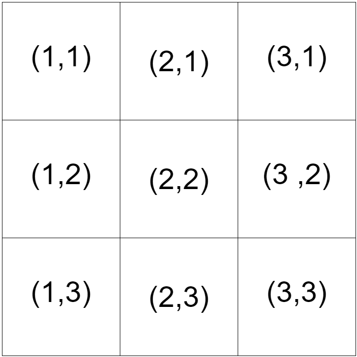

# IMPLEMENTACION AUN EN MODIFICACION. NO LA TOME EN CUENTA COMO ENTREGA FINAL.
# The Knight's Tour

## Alumno: Sierra Casiano Vladimir

### Definición del problema:
Dado un tablero de NxN y una posición inicial se desea encontrar
el camino más largo con movimientos válidos (movimientos del caballo) de tal manera que 
cada casilla es visitada a lo más una vez.

## Cómo ejecutar el programa.

**Nota:** le recomendamos leer la sección de Representación de la información para interpretar correctamente los resultados.

 

### Ejecución de solución con fuerza bruta.

**Warning:** no utilice tableros de longitud mayor a 5x5 con este método, pues el tiempo 
de ejecición requerido es muy grande. 

1. Ingrese a la carpeta src/Busqueda.
2. Ejecute en una terminal el comando

        $> swipl simple_solution.pl
        
3. Las consultas se hacen con el predicado

        find_max_length(N, Pos_inicial, Z).
    
    donde N es el tamaño del lado del tablero, Pos_inicial es la posición
    de inicio de la pieza siguiendo un formato de '(X,Y)'.
    
    Por ejemplo, para un tablero de 3x3 con casilla inicial la de la esquina superior izquierda
    del tablero, la consulta es la siguiente
    
        ?- find_max_length(3, (1,1) , Z).
        
    El resultado es de la forma
    
        Z =  (7,[(1,1),(2,3),(3,1),(1,2),(3,3),(2,1),(1,3),(3,2)]).

    El primer elemento del par indica la longitud del camino, mientras que el segundo elemento es una lista que 
    representa el camino. 
     

 

### Ejecución de solución con heurística.

1. Ingrese a la carpeta src/Busqueda.
2. Ejecute en una terminal el comando

        $> swipl heuristic_solution.pl
        
3. Las consultas se hacen con el predicado

        find_max_length(N, Pos_inicial, Z).
    
    donde N es el tamaño del lado del tablero, Pos_inicial es la posición
    de inicio de la pieza siguiendo un formato de '(X,Y)'.
    
    Por ejemplo, para un tablero de 5x5 con casilla inicial la del centro
    del tablero, la consulta es la siguiente
    
        ?- find_max_length(5, (3,3) , Z).
        
    El resultado es de la forma
    
        Z =  (13,[(3,3),(4,5),(2,4),(3,2),(4,4),(5,2),(3,1),(2,3),(4,2),(5,4),(3,5),(1,4),(2,2),(3,4)]).

    El primer elemento del par indica la longitud del camino, mientras que el segundo elemento es una lista que 
    representa el camino. 
        

 

        
### Ejecución de solución con ABC.

1. Ingrese a la carpeta src/BeeColony.
2. Ejecute en una terminal el comando

        $> swipl bee_colony.pl
        
3. Las consultas se hacen con el predicado

        bee_algorithm(N, Pos_inicial, Repeticiones, Num_abejas, Z).
    
    donde N es el tamaño del lado del tablero, Pos_inicial es la posición
    de inicio de la pieza siguiendo un formato de '(X,Y)', Repeticiones 
    es el numero de iteraciones que se desea realizar y Num_abejas
    el numero de agentes.
    
    Por ejemplo, para un tablero de 3x3 con casilla inicial la esquina 
    superior izquierda, haciendo 100 iteraciones con 32
    agentes la consulta es la siguiente
    
        ?- bee_algorithm(3, (1,1) , 100 , 32, Z).
 
    El resultado es de la forma
    
        Z =  (19,[(3,3),(4,1),(5,3),(4,5),(2,4),(4,3),(5,1),(3,2),(4,4),(5,2),(3,1),(2,3),(3,5),(1,4),(2,2),(3,4),(4,2),(2,1),(1,3),(2,5)]).

    El primer elemento del par indica la longitud del camino, mientras que el segundo elemento es una lista que 
    representa el camino. 
    

 

    
## Representación de la información.

La posición en el tablero es un par  (X,Y) , donde
X es el número de la columna y Y el número del renglón.
Ambos valores están en un rango entre 1 y N (longitud
del lado del tablero). 

Por ejemplo, para un tablero de 3x3 los
pares para cada posición son los siguientes

